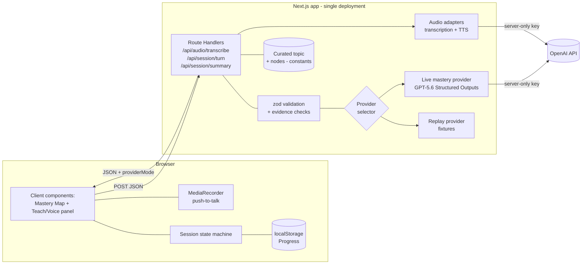
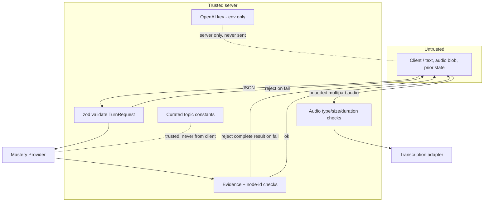
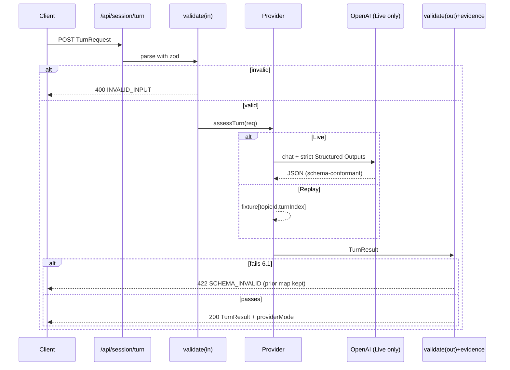

# SishyaGuru — System Architecture

> Companion to `docs/blueprint/SISHYAGURU_MASTER_BLUEPRINT_v1.md`. The blueprint is the
> source of truth; this document describes *how the code is arranged* to satisfy it with
> the smallest safe architecture. Decisions are recorded as ADRs (see `adr/`).

- **Category:** Education. Shares no logic with Incident Commander AI.
- **Shape:** One Next.js 15+ App Router application, strict TypeScript, three narrow
  server routes, no database, no auth, no queue, no microservice, no vector DB (ADR-001).

---

## 1. Architecture at a glance



Everything left of the OpenAI box ships as one Next.js deployment. The dashed trust
boundary is the Route Handler: client input is untrusted, the key and curated topic are
trusted server constants.

---

## 2. Module layout (intended)

Directories are described for the implementation team; this doc creates none of them.

```
app/
  page.tsx                     # the single learner surface (server shell)
  api/audio/transcribe/route.ts # bounded audio -> transcript (Live only)
  api/session/turn/route.ts    # POST turn: validate -> provider -> validate -> respond
  api/session/summary/route.ts # POST summary
components/                    # MasteryMap, TeachPanel, VoiceTurn, TranscriptReview, AudioPlayer
lib/
  contract.ts                  # TS types + zod schema (single source of the contract)
  validation.ts                # evidence/substring/node-id checks (blueprint 6.1)
  provider/
    index.ts                   # selectProvider() from server env
    live.ts                    # OpenAI Structured Outputs adapter
    replay.ts                  # fixture adapter
  audio/
    transcribe.ts              # server-only gpt-4o-mini-transcribe adapter
    speak.ts                   # exact probe text -> gpt-4o-mini-tts
    policy.ts                  # MIME/size/duration/timeout limits
  topic/water-cycle.ts         # Water Cycle + 6-8 nodes (trusted constants)
fixtures/                      # replay fixtures + adversarial cases
```

- `lib/contract.ts` is the **one** place the request/response shape is defined. The zod
  schema is exported both for runtime validation and as the JSON Schema handed to
  OpenAI. Live and Replay cannot diverge.
- No shared state between requests. The server is stateless (blueprint §10).

---

## 3. Trust boundaries



- `explanation`, `priorStates`, presentation preference, and an optional bounded audio
  blob are untrusted. Text is passed to the model **as data**, never concatenated into
  system instructions. Audio reaches only the transcription adapter.
- `providerMode` is chosen from server env only. A client cannot select Live or spend credits.
- The key exists only in `process.env` inside the Route Handler / Live adapter. It is
  never imported into a client component and never returned.

---

## 4. Request lifecycle (turn)



Summary requests follow the same lifecycle against `/api/session/summary`.

### 4.1 Voice lifecycle

1. The browser requests microphone permission only after the learner activates
   push-to-talk and records at most 60 seconds.
2. The client rejects obvious empty/oversize/unsupported media, then sends the blob to
   `/api/audio/transcribe`; the server independently revalidates MIME, bytes, timeout,
   and Live mode before calling `gpt-4o-mini-transcribe`.
3. The blob is never written to disk or logs. The returned transcript is shown in the
   same editable textarea; only explicit submit creates a normal `TurnRequest`.
4. GPT-5.6 returns the validated text probe. If speech was requested, the turn handler
   renders that exact probe through `gpt-4o-mini-tts` and attaches bounded base64 MP3 to
   the transport envelope. There is no arbitrary-text speech endpoint.
5. TTS failure is presentation-only: the valid mastery result and visible text probe
   remain. Replay uses versioned simulated fixtures and makes no OpenAI audio calls.

---

## 5. Data & persistence

- **No database.** No server-side persistence of any kind (ADR-001).
- **Progress** = `Record<nodeId, MasteryState>` + last-updated timestamp + topicId,
  serialized to a single `localStorage` key namespaced `sishyaguru:progress:v1`
  (ADR-004). Versioned key so a schema change can be migrated or discarded.
- **Curated topic** is a compiled-in constant, not fetched.
- **Fixtures** are compiled-in JSON for Replay.
- Raw recordings and generated probe audio are ephemeral transport data and are never
  stored in `localStorage`, server files, logs, or progress.

Persistence failure modes: `localStorage` unavailable (private mode / disabled) →
progress silently degrades to in-memory only for the session; the app still runs. No
crash, no blocking.

---

## 6. Provider architecture

See ADR-003. The selector reads `SISHYAGURU_PROVIDER` (`live` | `replay`, default
`replay`) once per request from server env. Both providers implement one interface and
both outputs pass the identical validation. The Live adapter sets `strict: true`
Structured Outputs so the model response is schema-shaped before it even reaches
validation. The response always carries the server-authoritative `providerMode` so the
UI labels Replay as *Simulated* truthfully (blueprint §8).

The audio adapters are presentation boundaries, not mastery providers. Transcription
produces candidate text that requires learner confirmation; TTS renders only the already
validated probe. This keeps the evidence contract independent of audio model behavior.

---

## 7. Failure & resilience

- One in-flight Provider call per session; submit disabled while pending (blueprint §4).
- Record, transcribe, assess, and speak are serialized; no background listening or
  parallel audio/model fan-out.
- No automatic retries. The learner may explicitly retry after `PROVIDER_ERROR` or
  `SCHEMA_INVALID`; there are no retry storms or fan-out.
- Timeouts enforced against the performance budget (blueprint §13); on timeout the prior
  valid map is preserved and Replay is suggested.
- Errors are mapped to the safe codes in blueprint §14 before leaving the server. Raw
  provider payloads, stack traces, and the key never reach the client.

---

## 8. Security summary

- Server-only key; verified absent from client bundle by a build-time check/test.
- Explanations never logged verbatim; only length/hash + metadata (blueprint §12).
- Structured Outputs + substring-evidence check bound prompt-injection blast radius:
  no tools, no browsing, no side effects, fixed schema (blueprint §7).
- Clearing progress requires explicit confirmation (blueprint §9).
- Audio is allow-listed, byte/duration limited, memory-only, and never logged. No speaker,
  emotion, biometric, or accent analysis exists.
- Full threat treatment lives in the security/threat doc when authored; this section is
  the architectural stance, not the complete threat model.

---

## 9. Accessibility architecture

- Mastery Map nodes render **label + shape/icon + colour** so state never depends on
  colour alone; each node carries an `aria-label` with its state (blueprint §11).
- Result updates are announced via an `aria-live="polite"` region.
- Full keyboard path: textarea or push-to-talk → transcript review → submit → audio
  play/pause/stop → map → end-session → clear-progress.
- Visible text is always equivalent to spoken content. Microphone denial and TTS failure
  preserve the complete text path; AI-generated speech is explicitly disclosed.
- `prefers-reduced-motion` disables map transition animation.

---

## 10. Observability architecture

- A thin logging helper at the route boundary emits one structured record per call
  (mode, topicId, turnIndex, latency, status, live-cost estimate). It is the only place
  that logs, and it is allow-listed to never receive the key or verbatim explanation.
- Audio calls log only random request id, MIME family, duration/bytes, latency, adapter
  status, and provider mode—never audio, transcript, generated bytes, or permission state.
- Client shows a provider badge + latency for demo transparency. No third-party analytics.

---

## 11. Test matrix

| Layer | Test | Asserts |
| --- | --- | --- |
| Contract | Fixtures validate vs schema | Live/Replay share one contract |
| Contract | Missing evidence quote → reject complete result | Blueprint §6.1 rule 3 |
| Contract | Unknown nodeId → reject | Rule 2 |
| Contract | Non-substring quote → reject complete result | Rules 3–4 |
| Contract | Oversize/empty explanation → INVALID_INPUT | §14 |
| State | Illegal transition rejected | Blueprint §4 invariants |
| State | Single in-flight call | §4 |
| Provider | Live & Replay parity | §8 |
| Truthfulness | Replay labelled + providerMode = env | §8 |
| Security | Key absent from bundle & responses | §8 |
| Security | Explanation absent from logs | §12 |
| A11y | Non-colour state + aria labels + keyboard | §11 |
| Smoke | Golden loop end-to-end in Replay | §16 |
| Voice | Transcript cannot auto-submit | Explicit confirmation invariant |
| Voice | MIME/size/duration/timeout limits | Rejected before audio provider |
| Voice | Raw audio absent from storage/logs | Ephemeral boundary |
| Voice | TTS input equals validated probe | No arbitrary speech surface |
| Voice | Permission/TTS failures preserve text path | Accessibility and resilience |
| Truthfulness | Replay audio/transcript fixtures labelled simulated | No OpenAI audio claim |

Frameworks: the project's standard TS test runner + a headless browser smoke for the
golden loop. No new heavyweight test infra beyond what the loop needs.

---

## 12. Deployment

- Single Next.js app; one build artifact; one deployment target.
- Env vars: `OPENAI_API_KEY` (empty unless Live), `OPENAI_MODEL` (default `gpt-5.6`),
  `OPENAI_TRANSCRIBE_MODEL` (default `gpt-4o-mini-transcribe`), `OPENAI_TTS_MODEL`
  (default `gpt-4o-mini-tts`), `OPENAI_TTS_VOICE` (default `marin`), and
  `SISHYAGURU_PROVIDER` (default `replay`). Documented in `.env.example` with empty secret.
- Default deployment runs Replay so judging needs no credential.

---

## 13. What this architecture deliberately omits

Per the ladder (smallest safe design): no DB, no auth service, no queue, no worker, no
microservice split, no vector DB, no state server, no feature-flag service, no ORM, no
custom cache. Each is unbuilt because P0's golden loop is a single stateless
request/response with client-owned progress. Add any of them only when evidence — not
speculation — demands it. See blueprint §18 for the full not-built list.

Realtime/WebRTC sessions, wake words, telephony, continuous listening, audio retention,
custom voices, and speech biometrics are also omitted. Bounded request-based audio is the
smallest voice layer that preserves learner review and the canonical evidence contract.
