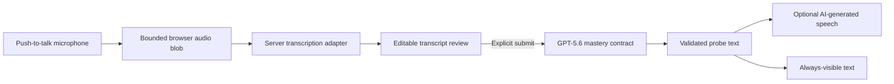

# SishyaGuru Voice Architecture

**Status:** Planned / pre-production. No working voice path is claimed.

## Decision summary

Voice is an optional turn-based interface over the canonical text mastery contract:

The learner's confirmed transcript—not raw audio—is `TurnRequest.explanation`. Audio
never becomes mastery evidence. This preserves the existing Zod schema, exact-substring
evidence validation, Live/Replay truthfulness and browser-local progress model.

## Components

- Browser `MediaRecorder`: explicit push-to-talk only; 60-second and 5-MB P0 limits.
- `POST /api/audio/transcribe`: validates Live mode, MIME family, bytes and timeout;
  calls `gpt-4o-mini-transcribe`; returns transcript text; writes nothing to disk.
- Transcript review: visible editable text with explicit submit/cancel. No auto-submit.
- `POST /api/session/turn`: unchanged GPT-5.6 Structured Outputs assessment. When
  `outputMode` requests audio, it renders only validated `probe.question` through
  `gpt-4o-mini-tts` using a built-in voice and returns it in the transport envelope.
- Replay: deterministic text and optional versioned audio fixtures, always labelled
  simulated; it never calls OpenAI audio APIs.

## Security and privacy controls

- Server-only API key; no browser key or long-lived client audio credential.
- Audio is memory-only and is not stored in progress, files, databases, logs or fixtures.
- Allow-listed media, strict byte/duration caps, rate limit, abort/timeout and safe errors.
- Logs contain only random request id, MIME family, byte/duration buckets, latency,
  provider mode and status—never audio, transcript, generated bytes or permission state.
- No continuous listening, wake word, speaker identification, biometric processing,
  emotion/accent scoring, telephony or custom voice cloning.
- The UI discloses both external transcription processing and AI-generated speech.

## Accessibility and resilience

Text is always first-class. Every voice turn produces an editable transcript, every
spoken probe has identical visible text, and all record/review/playback controls are
keyboard and screen-reader operable. Permission denial, unsupported recording,
transcription failure and TTS failure keep the text path usable and prior mastery intact.

TTS is presentation-only: its failure does not invalidate or roll back a valid mastery
result. Transcription cannot mutate learning state until the learner submits its text.

## Why not Realtime in P0

The P0 loop is intentionally bounded and review-gated. OpenAI documents request-based
audio APIs for bounded audio/text requests and Realtime sessions for continuous,
low-latency interaction. Realtime would add WebRTC credentials, turn detection,
interruptions and another session state machine while weakening the explicit transcript
review gate. It is deferred until user evidence justifies that complexity.

## Verification gates

- MIME/byte/duration/timeout rejection before provider use.
- No microphone request before user activation and no background capture.
- Transcript review/edit and explicit submit are mandatory.
- Audio/transcripts absent from storage and logs.
- TTS input exactly equals the validated probe text.
- AI-generated voice disclosure and text equivalence are visible.
- Replay makes zero OpenAI audio calls and labels fixtures simulated.
- Text-only golden path passes without microphone permission.

## Official references

- [Audio and speech](https://developers.openai.com/api/docs/guides/audio)
- [Realtime and audio](https://developers.openai.com/api/docs/guides/realtime)
- [Speech to text](https://developers.openai.com/api/docs/guides/speech-to-text)
- [Text to speech](https://developers.openai.com/api/docs/guides/text-to-speech)

