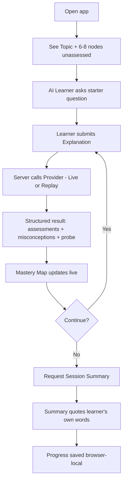
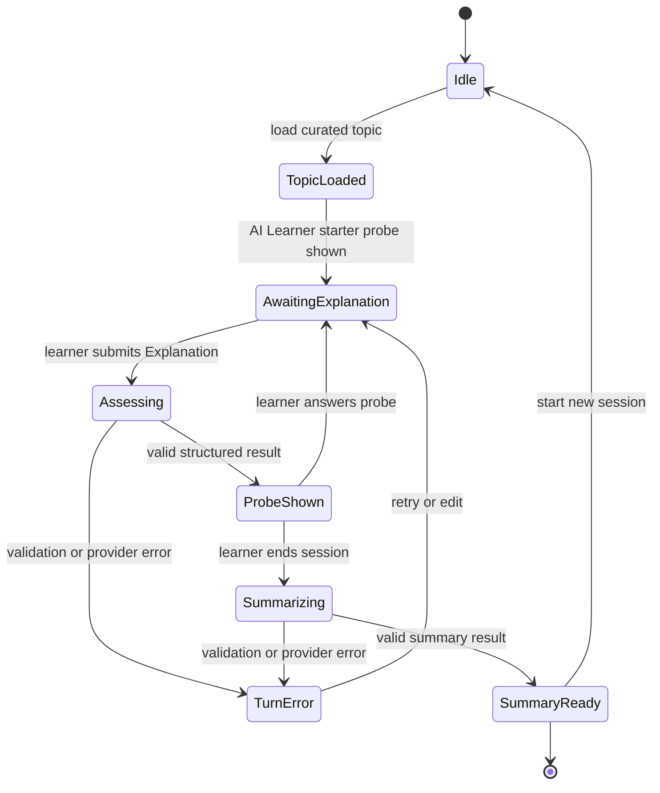

# SishyaGuru — Master Blueprint v1

> **You teach. AI learns. You master.**

SishyaGuru is a reverse-teaching mastery coach where students teach an AI learner,
answer its curious questions, and watch their understanding grow through a live
concept mastery map.

This document is the single source of truth for the SishyaGuru product. Every other
document (architecture, ADRs, PRD, tests) refines but never contradicts what is
written here. Where a conflict appears, this blueprint wins.

- **Primary category:** Education.
- **Status:** Pre-production. No working product and no live GPT-5.6 result are claimed yet.
- **Scope of this document:** P0 — the smallest golden learning loop that safely
  demonstrates the concept. Everything beyond P0 is explicitly labelled *Not built in P0*.

---

## 1. Product thesis

Learning is proven by teaching. The Feynman technique — explain a concept in plain
words until the gaps show — is the oldest mastery test there is. SishyaGuru inverts the
usual tutor: instead of the AI lecturing the student, the **student teaches the AI**,
the AI plays a *curious, slightly-behind learner* that asks the naive follow-up
questions a real novice would ask, and the system watches where the student's
explanation is **secure**, **shaky**, or **missing** — surfacing that as a live concept
mastery map.

The output is **formative guidance**, never a grade. SishyaGuru tells a learner *"here
is where your explanation was strong and here is where it wobbled, in your own words"* —
it never certifies competence, issues a score of record, or diagnoses ability.

### Why this is not Incident Commander AI

SishyaGuru shares **no product logic, domain model, prompt design, or data flow** with
Incident Commander AI. Incident Commander AI is an operations/incident-response
assistant that ingests alerts and coordinates responders under time pressure.
SishyaGuru is an education product whose core object is a *learner's spoken explanation
of a concept* and whose core output is a *cited, uncertainty-aware mastery map*. There
is no incident, no alerting, no on-call, no responder coordination, and no runbook
anywhere in this product. Any reuse of Incident Commander product logic is a hard STOP
condition (see §16).

---

## 2. Domain vocabulary (canonical)

These terms are used with exactly this meaning across all code and documents.

| Term | Definition |
| --- | --- |
| **Learner** (a.k.a. the Sishya-as-teacher / user) | The human being. In a session they play the *teacher*. Overall they are the *student* whose mastery grows. The name SishyaGuru captures this: the student (*sishya*) becomes the teacher (*guru*). |
| **AI Learner** (a.k.a. the curious pupil) | The model persona. It plays a bright but slightly-behind novice who is genuinely curious and asks naive, probing follow-up questions. It never lectures, never grades, never claims authority. |
| **Topic** | One curated subject the learner teaches. P0 ships exactly **one** curated Topic. |
| **Concept Node** | One idea within a Topic. P0 Topic has **6–8** Concept Nodes. |
| **Concept Mastery Map** | The graph of Concept Nodes and their `masteryState`, rendered live. It is the product's signature surface. |
| **Explanation** | One turn of the learner teaching — free text the learner submits explaining part of the Topic. |
| **Curious Follow-up** (a.k.a. **Probe**) | The AI Learner's single naive question in response to an Explanation, designed to expose a gap without leading. |
| **Mastery Assessment** | The per-node formative judgment produced for a turn: a `masteryState` plus a **required verbatim quote of the learner's own words** as evidence. |
| **Misconception** | A flagged likely error in the learner's Explanation, always paired with a verbatim evidence quote and phrased as a gentle "worth double-checking" note, never "wrong". |
| **Evidence quote** | A short verbatim substring of the learner's Explanation. Every Mastery Assessment and every Misconception must carry one. No quote → no judgment (state falls back to `insufficient_evidence`). |
| **Mastery State** | Enum: `unassessed`, `insufficient_evidence`, `emerging`, `developing`, `secure`. Formative only. |
| **Turn** | One cycle: Explanation → Assessment → Probe. |
| **Session** | An ordered set of Turns over one Topic, ending in a Session Summary. |
| **Session Summary** | The formative wrap-up: strengths, gaps to revisit, and suggested next explanation, all quoting the learner's own words. |
| **Provider** | The source of model responses. Exactly two, explicitly labelled: **Live** (OpenAI Structured Outputs) and **Replay** (deterministic fixture). See ADR-003. |
| **Progress** | The learner's saved mastery across sessions, stored **browser-local only** (see ADR-004). |

### 2.1 Mastery State semantics

| State | Meaning | Requires evidence quote? |
| --- | --- | --- |
| `unassessed` | Node not yet touched this session. | No |
| `insufficient_evidence` | Learner referenced the node but said too little to judge, or no verbatim quote could be extracted. | No (this **is** the "we can't tell" state) |
| `emerging` | Learner showed partial, surface understanding. | Yes |
| `developing` | Learner showed working understanding with a gap or imprecision. | Yes |
| `secure` | Learner explained it clearly and correctly in their own words. | Yes |

`insufficient_evidence` is a first-class, always-available answer. The system must be
willing to say "we don't have enough to judge this yet." Overclaiming mastery is a
worse failure than admitting uncertainty.

---

## 3. Users and journeys

### 3.1 Primary user

A self-directed learner (student, bootcamper, or professional upskilling) who wants to
find the holes in their own understanding of a topic before an exam, interview, or
real-world use. They value honesty over flattery.

### 3.2 Judge / evaluator (secondary)

A hackathon judge with **no OpenAI credential** who must be able to experience the full
golden loop deterministically. Replay mode exists for them (and for offline demos and
tests). It is always clearly labelled as simulated.

### 3.3 Golden journey (P0)

1. Learner opens the app and sees the one curated Topic with its 6–8 Concept Nodes, all `unassessed`.
2. Learner reads a short prompt from the AI Learner: *"I'm trying to understand [Topic]. Can you teach me [starter concept]?"*
3. Learner types an Explanation and submits.
4. The system returns, in one structured response: an updated Mastery Assessment for the touched nodes (each with a quoted evidence snippet), any Misconceptions (each quoted), and one Curious Follow-up probe.
5. The Concept Mastery Map animates to the new states. The learner sees where they're `secure` vs `emerging` vs `insufficient_evidence`.
6. Learner answers the probe with another Explanation. Repeat 4–5 for a few Turns.
7. Learner ends the session and receives a Session Summary quoting their own words: strengths, gaps to revisit, suggested next explanation.
8. Progress persists browser-local; on return the map shows prior mastery, clearly dated.

### 3.4 Journey diagram



---

## 4. Session state machine

The client owns one session state machine. The server is stateless.



State invariants:

- **`Assessing` and `Summarizing` are the only states that call the Provider.** Exactly one in-flight Provider call at a time; the submit control is disabled while in-flight.
- A Turn only advances to `ProbeShown` if the response **passes schema validation** (§6). A malformed response is a `TurnError`, never a silently-accepted result.
- No state transition mutates the Concept Mastery Map except on a validated result.
- Ending the session is always available from `AwaitingExplanation` and `ProbeShown`.

---

## 5. The API boundary (single server route)

One Next.js Route Handler is the entire backend. The OpenAI key lives only there.

```mermaid
sequenceDiagram
    participant B as Browser (client component)
    participant R as Route Handler (/api/session/turn)
    participant P as Provider (Live=OpenAI | Replay=fixture)
    B->>R: POST TurnRequest (JSON)
    R->>R: validate TurnRequest (zod)
    R->>P: provider.assess(input)
    P-->>R: TurnResult (Live: Structured Outputs | Replay: fixture)
    R->>R: validate TurnResult against schema
    R-->>B: 200 TurnResult (+ providerMode label)
    Note over R: key never leaves server; errors mapped to safe codes
```

- Endpoints (P0): `POST /api/session/turn` and `POST /api/session/summary`. That is all.
- The route selects the Provider from server env (`SISHYAGURU_PROVIDER`), never from client input. A client cannot force Live mode or spend credits by crafting a request.
- The route **always** echoes the active `providerMode` (`"live"` | `"replay"`) in its response so the UI can label it truthfully.

---

## 6. Typed contract (request / response)

Contracts are strict TypeScript, validated at the boundary with a runtime schema
(zod) on the way in and the same schema on the way out. The **same** JSON Schema is
handed to OpenAI as the Structured Outputs `response_format`. Live and Replay
therefore satisfy one identical contract.

```ts
// ---- Shared domain ----
type MasteryState =
  | "unassessed"
  | "insufficient_evidence"
  | "emerging"
  | "developing"
  | "secure";

interface ConceptNode {
  id: string;            // stable slug, e.g. "big-o-notation"
  label: string;         // human label
}

// ---- Request ----
interface TurnRequest {
  topicId: string;                 // must match the one curated topic
  nodeIds: string[];               // the 6-8 node ids of the topic
  explanation: string;             // learner's teaching text, 1..4000 chars
  priorStates: Record<string, MasteryState>; // current map, client-owned
  turnIndex: number;               // 0-based
}

// ---- Response (also the OpenAI Structured Outputs schema) ----
interface MasteryAssessment {
  nodeId: string;                  // must be one of TurnRequest.nodeIds
  state: MasteryState;
  evidenceQuote: string | null;    // verbatim substring of explanation; null ONLY when state is unassessed/insufficient_evidence
  rationale: string;               // <= 240 chars, formative language
}

interface Misconception {
  nodeId: string;
  evidenceQuote: string;           // verbatim substring, REQUIRED
  gentleNote: string;              // "worth double-checking..." phrasing, <= 240 chars
}

interface TurnResult {
  assessments: MasteryAssessment[];
  misconceptions: Misconception[]; // may be empty
  probe: {
    question: string;              // the single Curious Follow-up
    targetsNodeId: string;         // which node the probe is trying to expose
  };
}

interface SummaryResult {
  strengths: { nodeId: string; evidenceQuote: string; note: string }[];
  gaps: { nodeId: string; note: string }[];   // gaps need not quote (absence of evidence)
  suggestedNextExplanation: string;
  disclaimer: string;              // fixed formative-not-a-grade disclaimer
}
```

### 6.1 Validation rules (enforced server-side, both directions)

1. `explanation` length 1..4000; reject empty/oversize with a safe error code.
2. Every `assessment.nodeId` and `misconception.nodeId` ∈ `TurnRequest.nodeIds`. Unknown node id → reject the whole result as `TurnError` (never invent nodes).
3. If `assessment.state ∈ {emerging, developing, secure}` then `evidenceQuote` is a **non-empty verbatim substring** of `explanation`. If the quote is missing or not found in the text, downgrade that node to `insufficient_evidence` (never fabricate evidence).
4. Every `misconception.evidenceQuote` must be a verbatim substring of `explanation`; misconceptions failing this are dropped.
5. `probe.targetsNodeId` ∈ `nodeIds`.
6. On any structural failure the route returns a typed error; the client stays on the prior valid map.

Rule 3 and 4 make **"quote the learner's own words for every judgment"** a hard,
mechanically-checked invariant, not a prompt suggestion.

---

## 7. Prompt boundary

- The system prompt defines the AI Learner persona (curious novice, never a grader),
  the formative-not-a-grade rule, the requirement to quote learner words, and the
  permission to answer `insufficient_evidence`.
- The **only** untrusted input crossing into the prompt is `explanation` and
  `priorStates`. It is passed as data, never concatenated into instructions. Curated
  Topic and Node definitions are trusted server constants.
- Structured Outputs (strict JSON Schema, `strict: true`) is the enforcement layer:
  the model cannot return prose, cannot add fields, cannot omit required fields.
- Prompt-injection stance: because the explanation is teaching text and the output is
  a fixed schema with no tool calls, no browsing, and no side effects, injected
  instructions in an explanation can at worst produce a low-quality assessment — never
  data exfiltration or action. The schema and the substring-evidence check bound the blast radius.

---

## 8. Provider interface & replay truthfulness

See ADR-003 for the decision. Summary:

```ts
interface Provider {
  mode: "live" | "replay";
  assessTurn(req: TurnRequest): Promise<TurnResult>;
  summarize(req: SummaryRequest): Promise<SummaryResult>;
}
```

- **Live** provider calls OpenAI with the configured model (`OPENAI_MODEL`, default
  `gpt-5.6`) using Structured Outputs.
- **Replay** provider returns pre-recorded fixtures keyed by `(topicId, turnIndex)`,
  passing through the identical validation.

**Replay truthfulness rules (non-negotiable):**

1. Replay responses are **clearly labelled** in the UI as *Simulated (Replay mode)* on every turn.
2. Replay data is **never** presented, logged, screenshotted, or submitted as a live GPT-5.6 result.
3. The active mode is server-authoritative and surfaced in `providerMode`; the UI badge reads directly from it.
4. Fixtures are hand-authored to be *plausible and pedagogically honest*, not cherry-picked to flatter.

---

## 9. Safety

- **Formative, never certified.** Every summary carries the fixed disclaimer: mastery
  is learning guidance, not a grade, credential, or diagnosis. No numeric score of record.
- **Evidence-bound judgments.** No mastery/misconception claim without the learner's
  own quoted words (enforced by §6.1).
- **Uncertainty allowed.** `insufficient_evidence` is always available and preferred over overclaiming.
- **Gentle misconception framing.** "Worth double-checking" not "wrong".
- **No PII solicited.** The app never asks for name, email, or identity. Explanations
  are topic teaching text.
- **Confirmation before destructive/outward actions.** Clearing saved progress requires
  explicit confirmation. There is no external publishing in P0.
- **Content scope.** One curated academic Topic; no open-ended chat, no user-supplied topics in P0.

---

## 10. Privacy

- **No database, no accounts, no server-side user storage in P0.**
- Progress is stored **only** in the browser (`localStorage`), owned by the user, and
  clearable by the user (ADR-004).
- The server route is stateless: it holds request data only for the duration of the
  call and does not persist explanations. Explanations are **not** logged verbatim
  (see §12 observability).
- The OpenAI key is server-only and never reaches the browser, logs, fixtures, or Git.

---

## 11. Accessibility (P0 baseline, not deferred)

- Keyboard-operable throughout: explanation textarea, submit, end-session, clear-progress.
- The Concept Mastery Map is **not colour-only**: each node shows a text label + an
  icon/shape per state, plus colour. State is announced to screen readers via
  `aria-label` (e.g. "Big-O notation: developing").
- Live updates announced through an `aria-live="polite"` region so a screen-reader user
  hears assessment/probe changes.
- Meets WCAG 2.1 AA contrast for text and state indicators.
- Respects `prefers-reduced-motion` for map animations.

---

## 12. Observability

- Structured server logs at the boundary: timestamp, `providerMode`, `topicId`,
  `turnIndex`, latency ms, result status (`ok` | `validation_error` | `provider_error`),
  and token/cost estimate for Live calls.
- **Never logged:** the OpenAI key, the full verbatim explanation, or evidence quotes.
  Log an explanation **length** and a hash if correlation is ever needed — never the text.
- A client-visible provider badge and turn latency indicator for demo transparency.
- No third-party analytics or telemetry in P0.

---

## 13. Performance & cost budgets

| Budget | Target (P0) |
| --- | --- |
| Replay turn round-trip | < 150 ms (local fixture, no network) |
| Live turn round-trip (p50) | < 6 s |
| Live turn round-trip (p95) | < 12 s (else show timeout error state) |
| Map re-render after result | < 100 ms |
| Live cost per turn | Bounded by `explanation` ≤ 4000 chars + capped `max_tokens`; est. ≤ ~1 model call per turn, no fan-out |
| Live calls per session | 1 per Turn + 1 for Summary; no background/polling calls |

Cost control: single call per user action, hard `max_tokens` cap, no retries beyond one,
Replay is the default provider so demos and tests spend nothing.

---

## 14. Error states

| Code | Cause | User-facing behaviour |
| --- | --- | --- |
| `INVALID_INPUT` | Empty/oversize explanation, bad topic/node ids | Inline message, keep text, no Provider call |
| `PROVIDER_TIMEOUT` | Live call exceeded budget | "The AI Learner is thinking too slowly — try again." Prior map intact. |
| `PROVIDER_ERROR` | OpenAI error / network | Same safe message + suggest Replay mode. Key/details never surfaced. |
| `SCHEMA_INVALID` | Result failed §6.1 validation | Treated as a failed turn; prior map intact; one retry offered. |
| `RATE_LIMITED` | OpenAI 429 | Backoff message; Replay suggested. |

No error ever leaks the key, stack traces, model internals, or raw provider payloads to the client.

---

## 15. Evaluation fixtures, tests, milestones

### 15.1 Evaluation fixtures

- One curated Topic with 6–8 Nodes, authored as trusted constants.
- A fixture set covering a full Replay session: a strong turn (`secure`), a shaky turn
  (`developing` + one Misconception), an under-specified turn (`insufficient_evidence`),
  and a Summary. Every fixture passes §6.1 validation.
- Adversarial fixtures: an explanation containing an injection attempt, an explanation
  quoting text the model might paraphrase (to test the substring-evidence check), and an
  empty/oversize explanation.

### 15.2 Tests (see architecture doc §Tests for the full matrix)

- **Contract tests:** every fixture validates against the schema; §6.1 rules enforced
  (missing quote → downgrade; unknown node → reject; non-substring quote → drop).
- **State machine tests:** illegal transitions rejected; only one in-flight call.
- **Provider parity test:** Live and Replay outputs satisfy the identical schema.
- **Truthfulness test:** Replay responses carry the simulated label; `providerMode` matches server env.
- **Accessibility smoke:** map exposes non-colour state + aria labels; keyboard path works.
- **Boundary security test:** key absent from client bundle and responses; explanation absent from logs.

### 15.3 Milestones

| Milestone | Content |
| --- | --- |
| **M0 — Architecture pack** | This blueprint + system architecture + 4 ADRs + PRD (this deliverable). |
| **M1 — Contract & fixtures** | TS types, zod schema, curated Topic, Replay fixtures, contract tests green. |
| **M2 — Golden loop (Replay)** | Full journey works end-to-end in Replay: teach → assess → probe → map → summary → browser-local progress. |
| **M3 — Live provider** | One bounded live GPT-5.6 turn behind the same contract; provider parity test green. |
| **M4 — Hardening** | Accessibility, error states, observability, security boundary tests green; demo script. |

---

## 16. Acceptance criteria (P0)

A P0 build is acceptable only when **all** hold:

1. One curated Topic with 6–8 Concept Nodes renders as a live Concept Mastery Map.
2. A learner can teach an Explanation and receive, via strict Structured Outputs, an updated per-node Mastery Assessment, zero-or-more Misconceptions, and one Curious Follow-up probe.
3. Every non-`unassessed`/`insufficient_evidence` assessment and every Misconception quotes the learner's own verbatim words; the substring check is enforced server-side.
4. `insufficient_evidence` / uncertainty is reachable and shown honestly.
5. A Session Summary quotes the learner's words and carries the formative-not-a-grade disclaimer.
6. Progress persists browser-local and is user-clearable with confirmation.
7. Replay mode runs the entire loop with **no credential** and is clearly labelled *Simulated* on every turn; it is never presented as a live result.
8. The OpenAI key never appears in the client bundle, responses, logs, fixtures, or Git.
9. The app is keyboard-operable and the map conveys state without relying on colour alone.
10. The product shares no logic with Incident Commander AI.

## 17. Definition of done (P0)

- All §16 acceptance criteria pass.
- Lint, typecheck, unit/contract tests, build, and a browser smoke of the golden loop all green.
- The four ADRs are recorded and match the code.
- No secret in Git history; `.env.example` documents required vars with empty values.
- README and project status docs reflect reality; no unbuilt capability is claimed as built.

---

## 18. Explicitly NOT built in P0

The following are named only to bound scope. None exist in P0 and none may be implied as
working:

- Database, accounts, authentication, multi-user, or server-side progress.
- Multiple topics, user-authored topics, or open-ended chat.
- Queues, background jobs, microservices, vector database, or RAG.
- External calendar, email, sharing, or publishing.
- Certified scores, credentials, transcripts, or diagnoses.
- Voice, multiplayer, or mobile-native clients.

Adding any of these to satisfy P0 is a STOP condition. P0 is the smallest architecture
that safely satisfies the golden loop.
