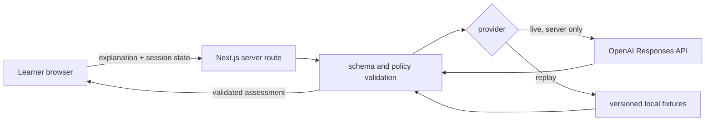

# Threat Model and Privacy Contract

## Scope

SishyaGuru accepts learner-authored explanations and returns formative, evidence-backed mastery guidance. P0 has no accounts, database, file upload, email integration, payments or social features.

## Trust boundaries

The browser is untrusted. Model output is untrusted until it passes the same schema and policy validation as replay data.

## Protected assets

- `OPENAI_API_KEY` and provider configuration.
- Learner explanations and session history.
- Curriculum rubric and concept identifiers.
- Provider provenance and live/replay truthfulness.
- Integrity of mastery evidence and state labels.

## Threats and controls

| Threat | P0 control | Verification |
|---|---|---|
| API key reaches browser bundle | Read key only in server-only module; never expose `NEXT_PUBLIC_*` secret | Build scan and bundle search |
| Prompt injection in learner text | Delimit learner content; system policy and rubric are not user-controlled; validate output | Injection evaluation fixture |
| Model invents evidence | Evidence quote must be an exact substring of the learner explanation | Deterministic validator test |
| Unsupported mastery certainty | State is bounded; `insufficient_evidence` is allowed; UI labels judgments as formative estimates | Contract and UI tests |
| Replay presented as live | Provider provenance is mandatory and visible near results | Browser assertion |
| Cross-site scripting | Render text as text; no raw HTML or Markdown execution from learner/model content | XSS fixture |
| Oversized or abusive input | Trim and enforce character/turn limits before provider call | Boundary tests |
| Sensitive learner data retained | No server database; avoid request body logging; browser clear-session control | Code review and E2E clear flow |
| Model provides full answer too early | Response contract requires one focused question and bounded hint; policy validator rejects answer dumps | Evaluation grader |
| Harmful or shaming feedback | Respectful tone policy, neutral retry copy, no mental-health or ability diagnosis | Content fixtures and review |
| Cost or denial-of-wallet | Per-session turn budget, input/output limits and visible retry behavior | Route tests and manual check |
| Provider outage or malformed result | Fail closed with recoverable error; do not manufacture mastery updates | Contract tests |

## Data-minimization policy

- Collect no name, email, age, school, location or account identifier in P0.
- Tell learners not to include personal or sensitive information.
- Keep progress in browser storage only and provide a clear reset control.
- Send only the minimum current explanation, curated concept rubric and bounded prior context required for assessment.
- Configure OpenAI requests with storage disabled when supported by the selected API contract.
- Do not write raw learner explanations to server logs or analytics.

## Educational safety

- SishyaGuru provides formative guidance, not grades, credentials, diagnoses or admissions decisions.
- Mastery means “demonstrated in this conversation against this rubric,” not permanent knowledge.
- A learner can retry, inspect supporting evidence and clear the session.
- The product must distinguish a misconception from insufficient evidence.
- The AI must not shame, rank intelligence, or imply that uncertainty is failure.

## Security exit criteria

- Secret scan passes.
- Browser bundle contains no server secret.
- Injection, XSS, evidence-forgery and oversized-input fixtures fail safely.
- Replay/live provenance is visible and tested.
- No server-side persistence of learner content exists in P0.
